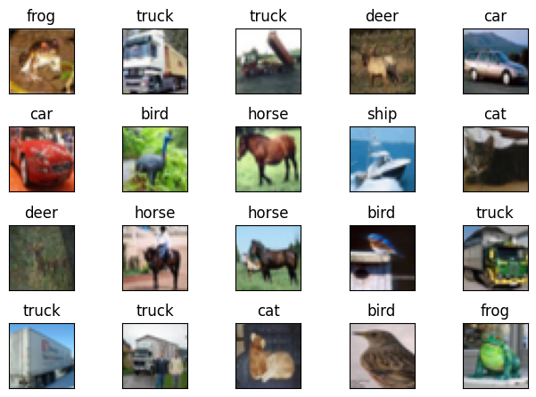
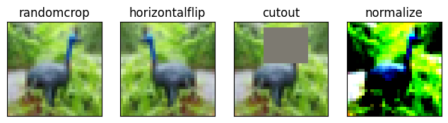
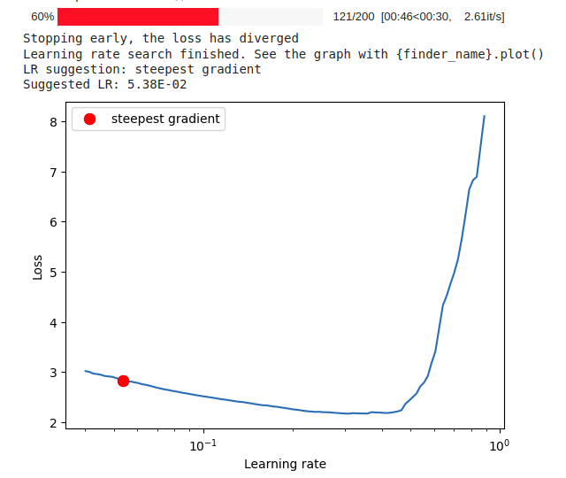
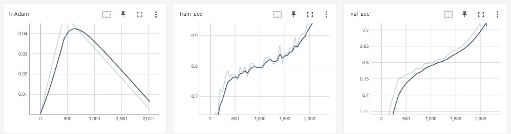
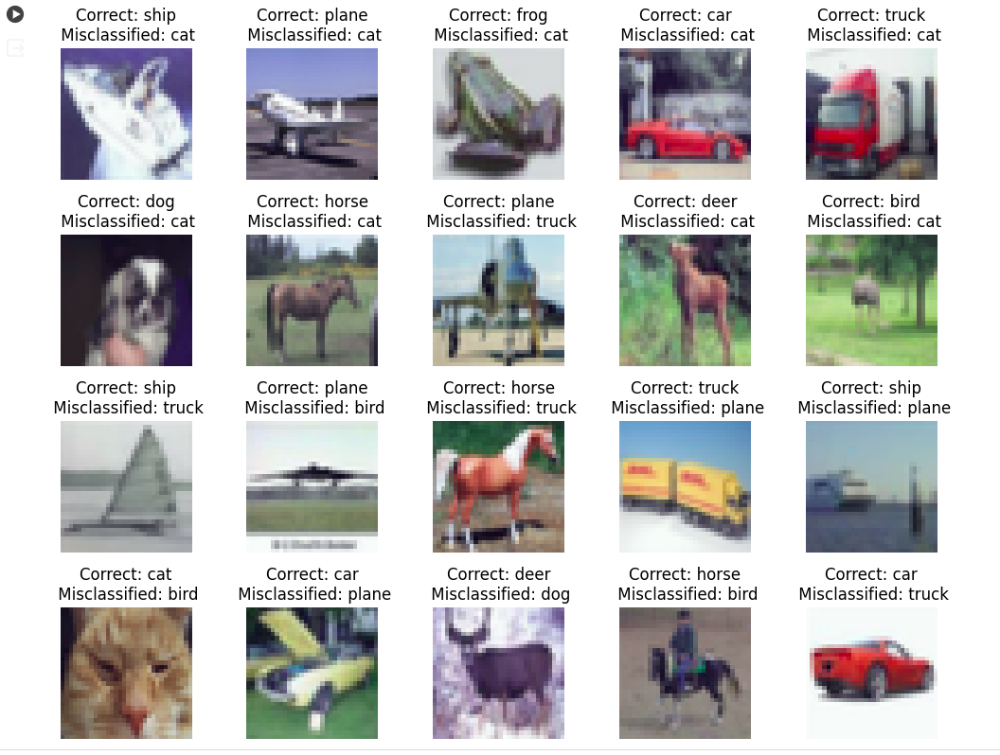

# PyTorch Lightning

This repository contains following files:

- `S13`: Notebook containing model training code using Pytorch Lightning

From Master repository below files are downloaded [Master Repo](https://github.com/Shivdutta/ERA2-Master)

- `resnetS11.py`: Model Architecture by Kaiming He, Xiangyu Zhang, Shaoqing Ren, Jian Sun -- Deep Residual Learning for Image Recognition. arXiv:1512.03385.
   All the classes are interited from Pytorch Lightning Module
- `dataset.py`: Contains class to use with [albumentations](https://github.com/albumentations-team/albumentations) library with PyTorch dataset
- `utils.py`: Contains functions to get misclassified data, dataset statistics and model summary, visualize data samples, augmentations, and misclassified images

## Code Details

- In the notebook mentioned above, several steps are executed to attain an accuracy of over 85% on the CIFAR10 dataset within 24 epochs:
- Training the model utilizing PyTorch Lightning.
- Leveraging Lightning enhances code conciseness, modularity, and facilitates parameter logging and monitoring. Additionally, it enables the saving of   checkpoints and early stopping based on various criteria."

### Model


- After importing all modules and files from this repository, an instance of the Resnet class is instantiated. 
- The neural network class LITResNet inherits from two parent classes:
  -  LightningModule 
  -  BasicBlock. 
- BasicBlock serves as a reusable custom class - comprising various convolutional layers, enhancing the organization and readability of the core structure."

```python
classes = ('plane', 'car', 'bird', 'cat', 'deer',
           'dog', 'frog', 'horse', 'ship', 'truck')

model = LITResNet(classes)
model
```

```bash
LITResNet(
  (inv_normalize): Normalize(mean=[-2.1739130434782608, -2.1739130434782608, -2.1739130434782608], std=[4.3478260869565215, 4.3478260869565215, 4.3478260869565215])
  (accuracy): MulticlassAccuracy()
  (conv1): Conv2d(3, 64, kernel_size=(3, 3), stride=(1, 1), padding=(1, 1), bias=False)
  (bn1): BatchNorm2d(64, eps=1e-05, momentum=0.1, affine=True, track_running_stats=True)
  (layer1): Sequential(
    (0): BasicBlock(
      (conv1): Conv2d(64, 64, kernel_size=(3, 3), stride=(1, 1), padding=(1, 1), bias=False)
      (bn1): BatchNorm2d(64, eps=1e-05, momentum=0.1, affine=True, track_running_stats=True)
      (conv2): Conv2d(64, 64, kernel_size=(3, 3), stride=(1, 1), padding=(1, 1), bias=False)
      (bn2): BatchNorm2d(64, eps=1e-05, momentum=0.1, affine=True, track_running_stats=True)
      (shortcut): Sequential()
    )
    (1): BasicBlock(
      (conv1): Conv2d(64, 64, kernel_size=(3, 3), stride=(1, 1), padding=(1, 1), bias=False)
      (bn1): BatchNorm2d(64, eps=1e-05, momentum=0.1, affine=True, track_running_stats=True)
      (conv2): Conv2d(64, 64, kernel_size=(3, 3), stride=(1, 1), padding=(1, 1), bias=False)
      (bn2): BatchNorm2d(64, eps=1e-05, momentum=0.1, affine=True, track_running_stats=True)
      (shortcut): Sequential()
    )
  )
  (layer2): Sequential(
    (0): BasicBlock(
      (conv1): Conv2d(64, 128, kernel_size=(3, 3), stride=(2, 2), padding=(1, 1), bias=False)
      (bn1): BatchNorm2d(128, eps=1e-05, momentum=0.1, affine=True, track_running_stats=True)
      (conv2): Conv2d(128, 128, kernel_size=(3, 3), stride=(1, 1), padding=(1, 1), bias=False)
      (bn2): BatchNorm2d(128, eps=1e-05, momentum=0.1, affine=True, track_running_stats=True)
      (shortcut): Sequential(
        (0): Conv2d(64, 128, kernel_size=(1, 1), stride=(2, 2), bias=False)
        (1): BatchNorm2d(128, eps=1e-05, momentum=0.1, affine=True, track_running_stats=True)
      )
    )
    (1): BasicBlock(
      (conv1): Conv2d(128, 128, kernel_size=(3, 3), stride=(1, 1), padding=(1, 1), bias=False)
      (bn1): BatchNorm2d(128, eps=1e-05, momentum=0.1, affine=True, track_running_stats=True)
      (conv2): Conv2d(128, 128, kernel_size=(3, 3), stride=(1, 1), padding=(1, 1), bias=False)
      (bn2): BatchNorm2d(128, eps=1e-05, momentum=0.1, affine=True, track_running_stats=True)
      (shortcut): Sequential()
    )
  )
  (layer3): Sequential(
    (0): BasicBlock(
      (conv1): Conv2d(128, 256, kernel_size=(3, 3), stride=(2, 2), padding=(1, 1), bias=False)
      (bn1): BatchNorm2d(256, eps=1e-05, momentum=0.1, affine=True, track_running_stats=True)
      (conv2): Conv2d(256, 256, kernel_size=(3, 3), stride=(1, 1), padding=(1, 1), bias=False)
      (bn2): BatchNorm2d(256, eps=1e-05, momentum=0.1, affine=True, track_running_stats=True)
      (shortcut): Sequential(
        (0): Conv2d(128, 256, kernel_size=(1, 1), stride=(2, 2), bias=False)
        (1): BatchNorm2d(256, eps=1e-05, momentum=0.1, affine=True, track_running_stats=True)
      )
    )
    (1): BasicBlock(
      (conv1): Conv2d(256, 256, kernel_size=(3, 3), stride=(1, 1), padding=(1, 1), bias=False)
      (bn1): BatchNorm2d(256, eps=1e-05, momentum=0.1, affine=True, track_running_stats=True)
      (conv2): Conv2d(256, 256, kernel_size=(3, 3), stride=(1, 1), padding=(1, 1), bias=False)
      (bn2): BatchNorm2d(256, eps=1e-05, momentum=0.1, affine=True, track_running_stats=True)
      (shortcut): Sequential()
    )
  )
  (layer4): Sequential(
    (0): BasicBlock(
      (conv1): Conv2d(256, 512, kernel_size=(3, 3), stride=(2, 2), padding=(1, 1), bias=False)
      (bn1): BatchNorm2d(512, eps=1e-05, momentum=0.1, affine=True, track_running_stats=True)
      (conv2): Conv2d(512, 512, kernel_size=(3, 3), stride=(1, 1), padding=(1, 1), bias=False)
      (bn2): BatchNorm2d(512, eps=1e-05, momentum=0.1, affine=True, track_running_stats=True)
      (shortcut): Sequential(
        (0): Conv2d(256, 512, kernel_size=(1, 1), stride=(2, 2), bias=False)
        (1): BatchNorm2d(512, eps=1e-05, momentum=0.1, affine=True, track_running_stats=True)
      )
    )
    (1): BasicBlock(
      (conv1): Conv2d(512, 512, kernel_size=(3, 3), stride=(1, 1), padding=(1, 1), bias=False)
      (bn1): BatchNorm2d(512, eps=1e-05, momentum=0.1, affine=True, track_running_stats=True)
      (conv2): Conv2d(512, 512, kernel_size=(3, 3), stride=(1, 1), padding=(1, 1), bias=False)
      (bn2): BatchNorm2d(512, eps=1e-05, momentum=0.1, affine=True, track_running_stats=True)
      (shortcut): Sequential()
    )
  )
  (linear): Linear(in_features=512, out_features=10, bias=True)
)
```
### Data Statistics

- All data-related operations are encapsulated within the model class itself. 
- Therefore, the extraction, loading, and transformation processes are performed using methods defined within the class.

```python
model.get_statistics()
model.get_statistics(data_set_type="Test")
```

```
[Train]
 - Total Train Images: 50000
 - Tensor Shape: (3, 32, 32)
 - min: (0.0, 0.0, 0.0)
 - max: (1.0, 1.0, 1.0)
 - mean: (0.49139968, 0.48215827, 0.44653124)
 - std: (0.24703233, 0.24348505, 0.26158768)
 - var: (0.061024975, 0.05928497, 0.06842812)
[Test]
 - Total Test Images: 10000
 - Tensor Shape: (3, 32, 32)
 - min: (0.0, 0.0, 0.0)
 - max: (1.0, 1.0, 1.0)
 - mean: (0.49421427, 0.48513183, 0.45040932)
 - std: (0.24665256, 0.24289224, 0.26159248)
 - var: (0.06083748, 0.058996636, 0.06843062)
```

### Data Visualization

```python
model.display_data_samples()
```



### Data Augmentation

```python
aug_set_transforms = {
    'randomcrop': A.RandomCrop(height=32, width=32, p=1),
    'horizontalflip': A.HorizontalFlip(p=1),
    'cutout': A.CoarseDropout(max_holes=1, max_height=16, max_width=16, min_holes=1, min_height=1, min_width=1, fill_value=(0.49139968*255, 0.48215827*255, 0.44653124*255), mask_fill_value=None, p=1),
    'normalize': A.Normalize((0.49139968, 0.48215827 ,0.44653124), (0.24703233, 0.24348505, 0.26158768)),
    'standardize': ToTensorV2(),
}

model.visualize_augmentation(aug_set_transforms)
```




### Data Transformations

Training and test data transformation is done by using `set_transforms()`

```python
# Train Phase transformations
train_set_transforms = {
    'randomcrop': A.RandomCrop(height=32, width=32, p=0.2),
    'horizontalflip': A.HorizontalFlip(),
    'cutout': A.CoarseDropout(max_holes=1, max_height=16, max_width=16, min_holes=1, min_height=1, min_width=1, fill_value=[0.49139968*255, 0.48215827*255 ,0.44653124*255], mask_fill_value=None),
    'normalize': A.Normalize((0.49139968, 0.48215827 ,0.44653124), (0.24703233, 0.24348505, 0.26158768)),
    'standardize': ToTensorV2(),
}

# Test Phase transformations
test_set_transforms = {
    'normalize': A.Normalize((0.49139968, 0.48215827, 0.44653124), (0.24703233, 0.24348505, 0.26158768)),
    'standardize': ToTensorV2()
}

# Set transformations for training and test dataset
model.set_transforms(train_set_transforms, test_set_transforms)
```
### Learning Rate Finder

- The LRFinder is employed to determine the optimal initial learning rate.
- Subsequently, the One Cycle Policy adjusts the learning rate during the training phase.
- The maximum learning rate is set to 5.38E-02."



### Training Configuration

- The LearningRateMonitor from the PyTorch Lightning module is utilized to track the learning rate throughout the training process.
- The ModelCheckpoint module is employed to save the model during training based on the validation loss. ModelSummary, also from the PyTorch Lightning module, is utilized to print a detailed summary of the network architecture.
- Lastly, the Trainer from the PyTorch Lightning module is used to facilitate the training of the model."

```python
# Monitor Learning rate while training to verify correct implementation of One cycle policy
lr_monitor = LearningRateMonitor(logging_interval="epoch")

# Save the last best model based on validation loss
checkpoint_callback = ModelCheckpoint(
    save_top_k=1,
    verbose=True,
    monitor='val_loss',
    mode='min',
)

# Define trainer for model training
trainer = pl.Trainer(
    callbacks=[ModelSummary(max_depth=-1), lr_monitor, checkpoint_callback],
    max_epochs = EPOCHS,
    check_val_every_n_epoch=1,
    num_sanity_val_steps=1
)

# Train the Model
trainer.fit(model)
```

### Model Training

- Model Summary 

```python
  INFO:pytorch_lightning.callbacks.model_summary:
   | Name                | Type               | Params
------------------------------------------------------------
0  | inv_normalize       | Normalize          | 0     
1  | accuracy            | MulticlassAccuracy | 0     
2  | conv1               | Conv2d             | 1.7 K 
3  | bn1                 | BatchNorm2d        | 128   
4  | layer1              | Sequential         | 147 K 
5  | layer1.0            | BasicBlock         | 74.0 K
6  | layer1.0.conv1      | Conv2d             | 36.9 K
7  | layer1.0.bn1        | BatchNorm2d        | 128   
8  | layer1.0.conv2      | Conv2d             | 36.9 K
9  | layer1.0.bn2        | BatchNorm2d        | 128   
10 | layer1.0.shortcut   | Sequential         | 0     
11 | layer1.1            | BasicBlock         | 74.0 K
12 | layer1.1.conv1      | Conv2d             | 36.9 K
13 | layer1.1.bn1        | BatchNorm2d        | 128   
14 | layer1.1.conv2      | Conv2d             | 36.9 K
15 | layer1.1.bn2        | BatchNorm2d        | 128   
16 | layer1.1.shortcut   | Sequential         | 0     
17 | layer2              | Sequential         | 525 K 
18 | layer2.0            | BasicBlock         | 230 K 
19 | layer2.0.conv1      | Conv2d             | 73.7 K
20 | layer2.0.bn1        | BatchNorm2d        | 256   
21 | layer2.0.conv2      | Conv2d             | 147 K 
22 | layer2.0.bn2        | BatchNorm2d        | 256   
23 | layer2.0.shortcut   | Sequential         | 8.4 K 
24 | layer2.0.shortcut.0 | Conv2d             | 8.2 K 
25 | layer2.0.shortcut.1 | BatchNorm2d        | 256   
26 | layer2.1            | BasicBlock         | 295 K 
27 | layer2.1.conv1      | Conv2d             | 147 K 
28 | layer2.1.bn1        | BatchNorm2d        | 256   
29 | layer2.1.conv2      | Conv2d             | 147 K 
30 | layer2.1.bn2        | BatchNorm2d        | 256   
31 | layer2.1.shortcut   | Sequential         | 0     
32 | layer3              | Sequential         | 2.1 M 
33 | layer3.0            | BasicBlock         | 919 K 
34 | layer3.0.conv1      | Conv2d             | 294 K 
35 | layer3.0.bn1        | BatchNorm2d        | 512   
36 | layer3.0.conv2      | Conv2d             | 589 K 
37 | layer3.0.bn2        | BatchNorm2d        | 512   
38 | layer3.0.shortcut   | Sequential         | 33.3 K
39 | layer3.0.shortcut.0 | Conv2d             | 32.8 K
40 | layer3.0.shortcut.1 | BatchNorm2d        | 512   
41 | layer3.1            | BasicBlock         | 1.2 M 
42 | layer3.1.conv1      | Conv2d             | 589 K 
43 | layer3.1.bn1        | BatchNorm2d        | 512   
44 | layer3.1.conv2      | Conv2d             | 589 K 
45 | layer3.1.bn2        | BatchNorm2d        | 512   
46 | layer3.1.shortcut   | Sequential         | 0     
47 | layer4              | Sequential         | 8.4 M 
48 | layer4.0            | BasicBlock         | 3.7 M 
49 | layer4.0.conv1      | Conv2d             | 1.2 M 
50 | layer4.0.bn1        | BatchNorm2d        | 1.0 K 
51 | layer4.0.conv2      | Conv2d             | 2.4 M 
52 | layer4.0.bn2        | BatchNorm2d        | 1.0 K 
53 | layer4.0.shortcut   | Sequential         | 132 K 
54 | layer4.0.shortcut.0 | Conv2d             | 131 K 
55 | layer4.0.shortcut.1 | BatchNorm2d        | 1.0 K 
56 | layer4.1            | BasicBlock         | 4.7 M 
57 | layer4.1.conv1      | Conv2d             | 2.4 M 
58 | layer4.1.bn1        | BatchNorm2d        | 1.0 K 
59 | layer4.1.conv2      | Conv2d             | 2.4 M 
60 | layer4.1.bn2        | BatchNorm2d        | 1.0 K 
61 | layer4.1.shortcut   | Sequential         | 0     
62 | linear              | Linear             | 5.1 K 
------------------------------------------------------------
11.2 M    Trainable params
0         Non-trainable params
11.2 M    Total params
44.696    Total estimated model params size (MB)
```

- Training Logs

```bash

Could not render content for 'application/vnd.jupyter.widget-view+json'
{"version_major":2,"version_minor":0,"model_id":"b754105ce95e447296237bbf1db93e12"}
Could not render content for 'application/vnd.jupyter.widget-view+json'
{"version_major":2,"version_minor":0,"model_id":"f2f83267166d4547b1a0746aad72ecce"}
Could not render content for 'application/vnd.jupyter.widget-view+json'
{"version_major":2,"version_minor":0,"model_id":"e5aefa4f919c417e8e99f1e32ed0d003"}
INFO:pytorch_lightning.utilities.rank_zero:Epoch 0, global step 88: 'val_loss' reached -2.66470 (best -2.66470), saving model to '/content/drive/MyDrive/Colab_Notebooks/Session13/lightning_logs/version_1/checkpoints/epoch=0-step=88.ckpt' as top 1
Could not render content for 'application/vnd.jupyter.widget-view+json'
{"version_major":2,"version_minor":0,"model_id":"ec7aee992cb545399e450354576456bf"}
INFO:pytorch_lightning.utilities.rank_zero:Epoch 1, global step 176: 'val_loss' was not in top 1
Could not render content for 'application/vnd.jupyter.widget-view+json'
{"version_major":2,"version_minor":0,"model_id":"a22a08d74a6c4cd093d1faf0784a3737"}
INFO:pytorch_lightning.utilities.rank_zero:Epoch 2, global step 264: 'val_loss' reached -2.70750 (best -2.70750), saving model to '/content/drive/MyDrive/Colab_Notebooks/Session13/lightning_logs/version_1/checkpoints/epoch=2-step=264.ckpt' as top 1
Could not render content for 'application/vnd.jupyter.widget-view+json'
{"version_major":2,"version_minor":0,"model_id":"5687b3f9a3964925a90a42161116fc6a"}
INFO:pytorch_lightning.utilities.rank_zero:Epoch 3, global step 352: 'val_loss' reached -2.79686 (best -2.79686), saving model to '/content/drive/MyDrive/Colab_Notebooks/Session13/lightning_logs/version_1/checkpoints/epoch=3-step=352.ckpt' as top 1
Could not render content for 'application/vnd.jupyter.widget-view+json'
{"version_major":2,"version_minor":0,"model_id":"249f8a7672c64705b319b38eb270ab55"}
INFO:pytorch_lightning.utilities.rank_zero:Epoch 4, global step 440: 'val_loss' was not in top 1
Could not render content for 'application/vnd.jupyter.widget-view+json'
{"version_major":2,"version_minor":0,"model_id":"83a8f25302cd4faeb1edb5a24278a6e3"}
INFO:pytorch_lightning.utilities.rank_zero:Epoch 5, global step 528: 'val_loss' was not in top 1
Could not render content for 'application/vnd.jupyter.widget-view+json'
{"version_major":2,"version_minor":0,"model_id":"f3862d623bf3419884571606a6e4a45a"}
INFO:pytorch_lightning.utilities.rank_zero:Epoch 6, global step 616: 'val_loss' was not in top 1
Could not render content for 'application/vnd.jupyter.widget-view+json'
{"version_major":2,"version_minor":0,"model_id":"9bd30a3447954502bf00979361fd8e9e"}
INFO:pytorch_lightning.utilities.rank_zero:Epoch 7, global step 704: 'val_loss' was not in top 1
Could not render content for 'application/vnd.jupyter.widget-view+json'
{"version_major":2,"version_minor":0,"model_id":"88f5dafe7cae422199cfd716e9116b5f"}
INFO:pytorch_lightning.utilities.rank_zero:Epoch 8, global step 792: 'val_loss' reached -3.23594 (best -3.23594), saving model to '/content/drive/MyDrive/Colab_Notebooks/Session13/lightning_logs/version_1/checkpoints/epoch=8-step=792.ckpt' as top 1
Could not render content for 'application/vnd.jupyter.widget-view+json'
{"version_major":2,"version_minor":0,"model_id":"d8a0a8c45b70461dbb3b0dc6e1bddab7"}
INFO:pytorch_lightning.utilities.rank_zero:Epoch 9, global step 880: 'val_loss' was not in top 1
Could not render content for 'application/vnd.jupyter.widget-view+json'
{"version_major":2,"version_minor":0,"model_id":"3a74c7282fb7483a9a9c51c958d0c7e9"}
INFO:pytorch_lightning.utilities.rank_zero:Epoch 10, global step 968: 'val_loss' was not in top 1
Could not render content for 'application/vnd.jupyter.widget-view+json'
{"version_major":2,"version_minor":0,"model_id":"39b7b9a234e0405b95a7ba99a8b88bf0"}
INFO:pytorch_lightning.utilities.rank_zero:Epoch 11, global step 1056: 'val_loss' was not in top 1
Could not render content for 'application/vnd.jupyter.widget-view+json'
{"version_major":2,"version_minor":0,"model_id":"b034f363d501469ca7a1435b6ab528ad"}
INFO:pytorch_lightning.utilities.rank_zero:Epoch 12, global step 1144: 'val_loss' was not in top 1
Could not render content for 'application/vnd.jupyter.widget-view+json'
{"version_major":2,"version_minor":0,"model_id":"5e80f5d3ca964c6fb2dc64c1b9adf404"}
INFO:pytorch_lightning.utilities.rank_zero:Epoch 13, global step 1232: 'val_loss' reached -3.77326 (best -3.77326), saving model to '/content/drive/MyDrive/Colab_Notebooks/Session13/lightning_logs/version_1/checkpoints/epoch=13-step=1232.ckpt' as top 1
Could not render content for 'application/vnd.jupyter.widget-view+json'
{"version_major":2,"version_minor":0,"model_id":"968fa5a9abbd4693bd5b135b44d4e39f"}
INFO:pytorch_lightning.utilities.rank_zero:Epoch 14, global step 1320: 'val_loss' was not in top 1
Could not render content for 'application/vnd.jupyter.widget-view+json'
{"version_major":2,"version_minor":0,"model_id":"8064a2210bac491abc66f07246836b7b"}
INFO:pytorch_lightning.utilities.rank_zero:Epoch 15, global step 1408: 'val_loss' reached -3.95518 (best -3.95518), saving model to '/content/drive/MyDrive/Colab_Notebooks/Session13/lightning_logs/version_1/checkpoints/epoch=15-step=1408.ckpt' as top 1
Could not render content for 'application/vnd.jupyter.widget-view+json'
{"version_major":2,"version_minor":0,"model_id":"9d5078cc03ec437eaa1b18b0b1faf6a0"}
INFO:pytorch_lightning.utilities.rank_zero:Epoch 16, global step 1496: 'val_loss' was not in top 1
Could not render content for 'application/vnd.jupyter.widget-view+json'
{"version_major":2,"version_minor":0,"model_id":"a2deb9bcbd4e4a8b85951dbd689eee08"}
INFO:pytorch_lightning.utilities.rank_zero:Epoch 17, global step 1584: 'val_loss' reached -4.30008 (best -4.30008), saving model to '/content/drive/MyDrive/Colab_Notebooks/Session13/lightning_logs/version_1/checkpoints/epoch=17-step=1584.ckpt' as top 1
Could not render content for 'application/vnd.jupyter.widget-view+json'
{"version_major":2,"version_minor":0,"model_id":"d50c9b56fe70472285f218492b53c471"}
INFO:pytorch_lightning.utilities.rank_zero:Epoch 18, global step 1672: 'val_loss' reached -4.98038 (best -4.98038), saving model to '/content/drive/MyDrive/Colab_Notebooks/Session13/lightning_logs/version_1/checkpoints/epoch=18-step=1672.ckpt' as top 1
Could not render content for 'application/vnd.jupyter.widget-view+json'
{"version_major":2,"version_minor":0,"model_id":"a5ef954556c7425186a906177d68832e"}
INFO:pytorch_lightning.utilities.rank_zero:Epoch 19, global step 1760: 'val_loss' was not in top 1
Could not render content for 'application/vnd.jupyter.widget-view+json'
{"version_major":2,"version_minor":0,"model_id":"615f1b8b11354afeb1736d0f36bccf0d"}
INFO:pytorch_lightning.utilities.rank_zero:Epoch 20, global step 1848: 'val_loss' reached -5.38484 (best -5.38484), saving model to '/content/drive/MyDrive/Colab_Notebooks/Session13/lightning_logs/version_1/checkpoints/epoch=20-step=1848.ckpt' as top 1
Could not render content for 'application/vnd.jupyter.widget-view+json'
{"version_major":2,"version_minor":0,"model_id":"aa8755b2b72b4c0a8a2c8809859cc799"}
INFO:pytorch_lightning.utilities.rank_zero:Epoch 21, global step 1936: 'val_loss' reached -6.00171 (best -6.00171), saving model to '/content/drive/MyDrive/Colab_Notebooks/Session13/lightning_logs/version_1/checkpoints/epoch=21-step=1936.ckpt' as top 1
Could not render content for 'application/vnd.jupyter.widget-view+json'
{"version_major":2,"version_minor":0,"model_id":"6ccd0954d4b5499295f85cfbf8920881"}
INFO:pytorch_lightning.utilities.rank_zero:Epoch 22, global step 2024: 'val_loss' reached -6.48384 (best -6.48384), saving model to '/content/drive/MyDrive/Colab_Notebooks/Session13/lightning_logs/version_1/checkpoints/epoch=22-step=2024.ckpt' as top 1
Could not render content for 'application/vnd.jupyter.widget-view+json'
{"version_major":2,"version_minor":0,"model_id":"5efcdb2d89434228a78223e13fe76b23"}
INFO:pytorch_lightning.utilities.rank_zero:Epoch 23, global step 2112: 'val_loss' reached -7.19550 (best -7.19550), saving model to '/content/drive/MyDrive/Colab_Notebooks/Session13/lightning_logs/version_1/checkpoints/epoch=23-step=2112.ckpt' as top 1
INFO:pytorch_lightning.utilities.rank_zero:`Trainer.fit` stopped: `max_epochs=24` reached.
```
- Test Accuracy

```python
  trainer.test()
```

```bash
┏━━━━━━━━━━━━━━━━━━━━━━━━━━━┳━━━━━━━━━━━━━━━━━━━━━━━━━━━┓
┃        Test metric        ┃       DataLoader 0        ┃
┡━━━━━━━━━━━━━━━━━━━━━━━━━━━╇━━━━━━━━━━━━━━━━━━━━━━━━━━━┩
│          val_acc          │    0.8781999945640564     │
│         val_loss          │    -7.706530570983887     │
└───────────────────────────┴───────────────────────────┘
[{'val_loss': -7.706530570983887, 'val_acc': 0.8781999945640564}]

```

- Validation Accuracy

```python
  trainer.validate()
```

```bash
┏━━━━━━━━━━━━━━━━━━━━━━━━━━━┳━━━━━━━━━━━━━━━━━━━━━━━━━━━┓
┃        Test metric        ┃       DataLoader 0        ┃
┡━━━━━━━━━━━━━━━━━━━━━━━━━━━╇━━━━━━━━━━━━━━━━━━━━━━━━━━━┩
│          val_acc          │    0.8781999945640564     │
│         val_loss          │    -7.706530570983887     │
└───────────────────────────┴───────────────────────────┘
[{'val_loss': -7.706530570983887, 'val_acc': 0.8781999945640564}]
```

### Training Logs

- Training data is recorded during training
- Following are the learning rate, training and test accuracies logged during model training

```python
# start tensorboard
%load_ext tensorboard
%tensorboard --logdir lightning_logs/
```




### Display Misclassified IMages




### Save Misclassified Images

- Misclassified Images are saved on the drive to be shown on the Gradio App

  ```python
  
  img_dir = '/content/drive/MyDrive/Colab_Notebooks/Session13/misclassified/'
  os.makedirs(img_dir,exist_ok=True)

  misclassified_data = model.get_misclassified_data()

  for data in misclassified_data:
      # Extract misclassified image
      misclassified_img = data[0]

      # Denormalize and remap pixels to 0-255
      misclassified_img = model.inv_normalize(misclassified_img) * 255

      # Conver to numpy array
      ndarray_img = misclassified_img.cpu().numpy().squeeze(0).astype(np.uint8)

      # Channel repositioning
      rgb_img = np.transpose(ndarray_img, (1, 2, 0))

      # Convert to PIL format
      img = Image.fromarray(rgb_img)

      # Resize
      img.resize((416, 416))

      # File name = correct_misclassified.png
      file_name = str(classes[data[1].item()]) + '_' + str(classes[data[2].item()]) + '.png'

      # Save the image
      img.save(os.path.join(img_dir,file_name))

  # List all files in the directory
  image_files = os.listdir(img_dir)

  # Create a new figure
  fig = plt.figure(figsize=(10, 10))

  # Loop through the image files and load/display images
  for i, file_name in enumerate(image_files, start=1):
      # Construct the full path to the image
      image_path = os.path.join(img_dir, file_name)

      # Load the image
      image = Image.open(image_path)

      # Add the image to the subplot grid
      ax = fig.add_subplot(5, 5, i)
      ax.imshow(image)
      file_name_split=file_name.replace(".png","").split("_")
      ax.set_title("Correct: "+str(file_name_split[0]) + "\n Misclassified: " + str(file_name_split[1]) )
      ax.axis('off')  # Hide axis

      # Break the loop if 25 images have been displayed
      if i == 25:
          break

  # Adjust layout to prevent overlap
  plt.tight_layout()

  # Show the plot
  plt.show()

  ```
---

## Gradio App
- Link of Gradio app: https://huggingface.co/spaces/Shivdutta/S13
- Readme file for Gradio app : https://huggingface.co/spaces/Shivdutta/S13/blob/main/README.md
